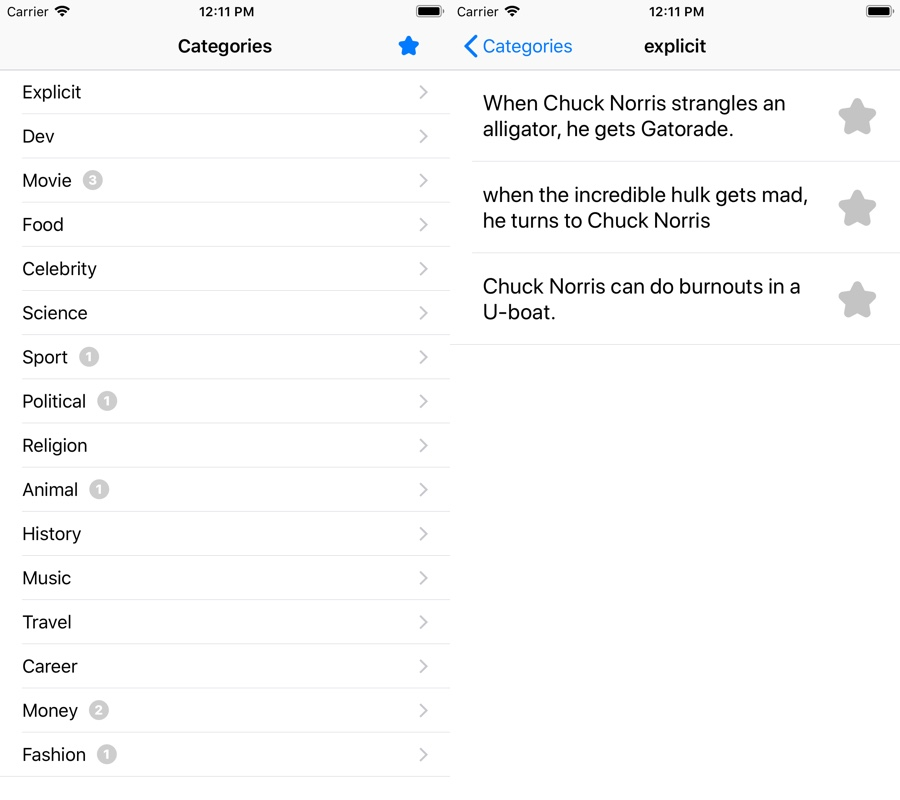

# Chuck Norris Jokes
#### _A simple app displaying chuck norris jokes written in Swift 4_

This is a quick mockup app which demonstrates how to load data form an API and display it on screen on iOS. Also local storage is used and Cocoapods library management.



Chuck Norris iOS app is developed using Swift 4 programming language.
This repository uses Git Flow for development. Master branch is the latest release. All development should be done by branching out from 'develop' branch.

## Installation

You'll need Cocoapods installed on your system to run this app.

1. To install Cocoapods open terminal and type the following: ```sudo gem install cocoapods```
2. Clone chuckJokes github repository.

3. Once you have successfully installed cocoapods and cloned the project then you're ready to install needed pods related to Hoopy Parent. To do this open Terminal and navigate to Hoopy-ios directory.
4. Type ```pod install``` and the external libraries will be installed on the project.
5. Then open Chuck Norris.xcworkspace with xCode and you're ready to compile. (note, don't open Chuck Norris.xcodeproj as this won't include the pods)

## External Libraries

* Disk by saoudrizwan for storage of favorite jokes - [Disk](https://github.com/saoudrizwan/Disk)
* BadgeSwift for badges - [swift-badge](https://github.com/evgenyneu/swift-badge)

## Authors

* **Tanel Teemusk** - *iOS Development* - [teemusk.com](https://teemusk.com)
